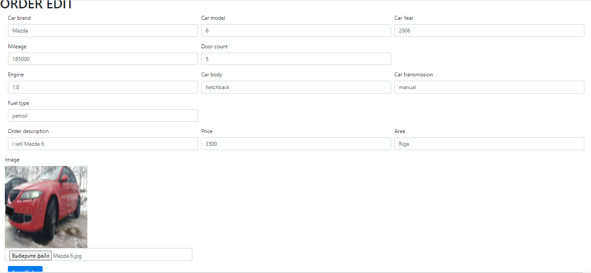

# job4j_auto-trader

### About the project
Car sales area. Built with html + bootstrap, servlets, Postgres + Hibernate.
Allows users to list their vehicles for sale. Ads are saved in the database. 
Images are saved on the server. The client and the controller exchange messages in JSON format.

### Technologies
* Java 14
* Java EE Servlets
* Apache Tomcat
* Hibernate, Postgres
* JS, AJAX, HTML5, Bootstrap (front)
* Gson, json-simple for parsing JSON
* hsqldb with inMem db - for testing the database
* Maven as a build system
* Travis C.I.

### Features
* Authorization / registration. Access only by authorized users (implemented through a filter). The authorized user saves to the session.
* Adding cars to the list for sale. Vehicle parameters are selected from reference books. It is possible to add a photo.
* Remove your ads from the list.
* Change the ad status to "sold".
* Filter to display only your own ads, filters to display only ads with photos, only for the current date, filter by car brand.### Demo

### In use

Registration page

Sign Up page

Ads list

Creating page

Edit page

Data base schema
